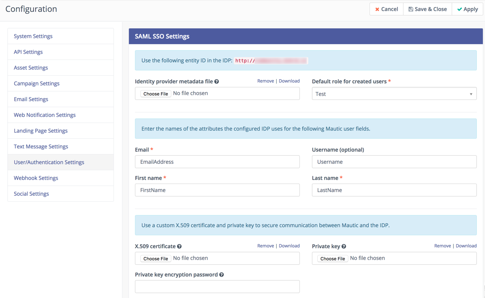

# SAML Single Sign On

SAML est un protocole d'authentification automatique en une fois et qui permet la création d'utilisateurs dans Mautic en utilisant un service tiers appelée fournisseur d'identité (IDP).

## Activer le SAML

Pour activer le SAML dans Mautic, vous devez d'abord obtenir les metadatas XML de l'IDP. Cela vous sera communiqué par l'IDP. Si c'est une URL, affichez cette URL dans votre navigateur et sauvegardez le contenu dans un fichier XML.

Dans Mautic, allez dans Configuration -> Utilisateurs/Paramètres d'authentification, puis chargez ce fichier comme `Fichier metadata du fournisseur d'identité`.

Il est recommandé de sélectionner une rôle non administrateur comme rôle par défaut lors de la création d'utilisateurs. Sélectionnez ce rôle dans dans la liste déroulante `Rôle par défaut pour les utilisateurs créés`.

## Configuration de l'IDP

Il vous sera nécessaire de configurer dans l'IDP les paramètres suivants :

1) `Entity ID` - ce sera l'URL du site et sera affichée en haut des paramètres d'utilisateurs/Authentication. Copiez exactement la valeur donnée par votre IDP.

2) `Service provider metadata` - si une URL est demandée, utilisez `https://your-mautic.com/saml/metadata.xml`. Si c'est un fichier qui est demandée, affichez cette URL dans votre navigateur et sauvegardez le contenu dans un fichier XML.

3) `Assertion consumer service` - Utilisez `https://your-mautic.com/s/saml/login_check`

4) `Issuer` - cela doit être donné par l'IDP, mais cela reste souvent configurable. Si c'est une URL, assurez vous que le protocole (http:// and https://) n'en fasse pas parti.

5) `Verify request signatures` ou un certificat SSL - si l'IDP supporte le chiffrement et la validation des requêtes des signatures depuis Mautic vers l'IDP, générez un certificat SSL. Chargez le certificat et la clé privée dans la configuration Mautic dans Configuration ->  Paramètres d'utilisateurs/Authentication dans la section `Utiliser un certificat X.509 et clé privée personnalisés pour sécuriser la communication entre Mautic et l'IDP.`. Puis chargez le certificat dans l'IDP.

6) `Custom attributes` - Mautic requière 3 attributs personnalisés qui doivent être inclus dans les réponses de l'IDP pour l'utilisateur : l'email, le prénom et le nom. Le nom d'utilisateur est également supporté mais optionnel. Configurez le nom des attributs utilisés par l'IDP dans la configuration de Mautic : Configuration ->  Paramètres d'utilisateurs/Authentication dans la section `Entrer les noms des attributs configurés dans l'IDP pour les champs Mautic.`.

## Connexion
Une fois Mautic configuré avec l'IDP (et réciproquement), Mautic sera redirigé par défaut vers la page d'authentification de l'IDP. `/s/login` est toujours disponible pour un login direct mais devra être directement saisi dans votre navigateur.

Connectez-vous à l'IDP et vous serez redirigé vers Mautic. Si le transfert est un succès, l'utilisateur sera créé s'il n'existe pas déjà, et vous serez connecté.

## Désactivation du SAML
Pour désactiver le SAML, cliquez simplement sur le lien `Supprimer` à droite de l'étiquette du `Identity provider metadata file`.  

