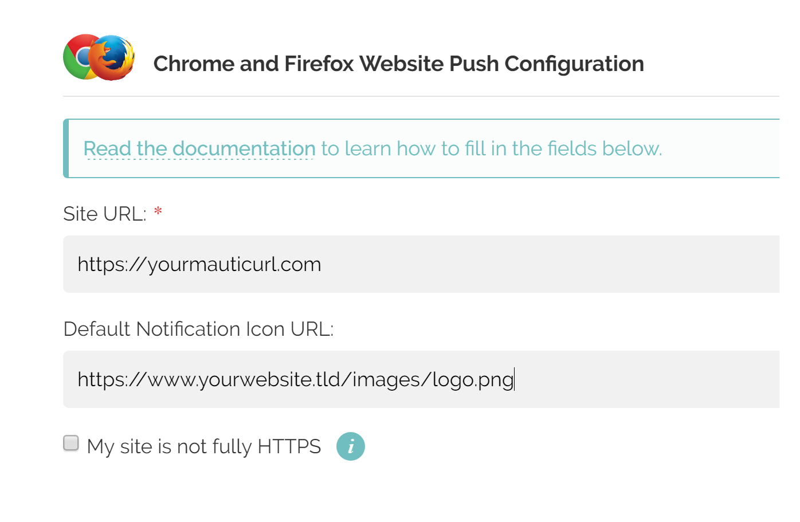
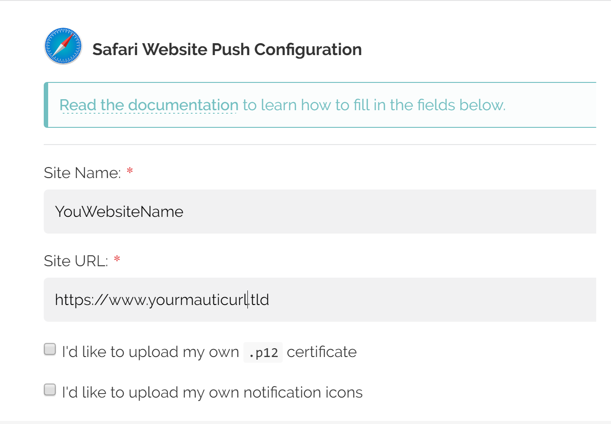

---------------------
Web notifications integrate [One Signal](https://onesignal.com/). Using your own OneSignal accounts, you can now push a notification to your contacts's browser (with their permission). Enable these in Mautic's Configuration to see them listed under Channels in the menu.

For more information see [One Signal documentation](https//documentation.onesignal.com/docs/web-push-setup)

### Setup

##### 1. Create [One Signal](https://onesignal.com/) account and app

##### 2. Setup app Website Push Platforms in you app

Google Chrome and Mozilla Firefox configuration example

Apple Safari (macOS) configuration example

##### 3. Setup Mautic

Enable Web Notification and copy keys from OneSignal to your Mautic > Settings > Configuration - Web Notification Settings tab

##### 4. Test

All visitors with supported browser will be ask receive notification on all you Mautic landing pages. Create campaign and use Push Website notification action.

### Options

##### Welcome Notifications

Option to allow disable welcome notifications.
For more informations see [One Signal documentation](https://documentation.onesignal.com/docs/welcome-notifications)

##### gcm_sender_id

Option gcm_sender_id is a shared key used for push notifications.
Use default value 482941778795. Previously it required your own key. Due backwards compatibility is editable (for older Mautic).

### HTTPS and HTTP support

HTTP support was added  in Mautic 2.6. 

We recommend use https of your websites. But http suport for onesignal.com  is very similar to https, nowdays.  Just user subdomain options on onesignal.com and in your Mautic.

For more informations about http notification support read  [One Signal documentation](https://documentation.onesignal.com/docs/web-push-sdk-setup-http)

### Support for Mautic landing pages and tracking pages

Support for tracking pages was added  in Mautic 2.6. 

Tracking page is your web page where you paste Mautic tracking code.

Don't forget copy these files to root dir of your tracking page:

https://yourmauticurl.tld/manifest.json
https://yourmauticurl.tld/OneSignalSDKWorker.js
https://yourmauticurl.tld/OneSignalSDKUpdaterWorker.js
