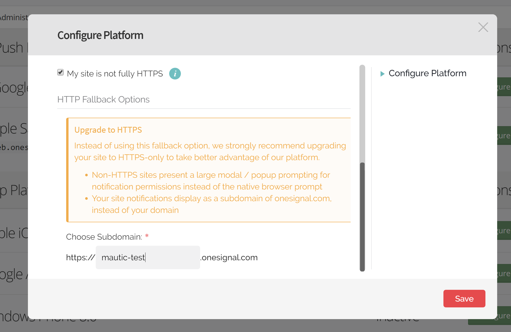

---------------------
## What are Web Notifications?

Web Notifications can be an extremely powerful tool for the marketer. Mautic integrated with OneSignal allows you to push information to a contact as they browse through web resources (Mautic landing pages, or [with some configuration][onesignal-docs-https], on your own website), giving you one more channel that you can use to build a relationship with them.

Web notifications in Mautic are provided by integrating with [One Signal][onesignal]. Using your own OneSignal accounts, you can now push a notification to your contacts's browser (with their permission). Enable these in Mautic's Configuration to see them listed under Channels in the menu.

For more information see [One Signal documentation][onesignal-docs].

## Setup

1. Create [One Signal][onesignal] account and app

2. Setup app Website Push Platforms in you app

Google Chrome and Mozilla Firefox configuration example

Apple Safari (macOS) configuration example

3. Configure Mautic

Enable Web Notification and copy keys from OneSignal to your Mautic > Settings > Configuration - Web Notification Settings tab

4. Test

All visitors with supported browser will be ask receive notification on all you Mautic landing pages. Create campaign and use Push Website notification action.

## Options

### Welcome Notifications

Option to allow disable welcome notifications.
For more informations see [One Signal documentation][onesignal-docs-welcome]

### gcm_sender_id

Option gcm_sender_id is a shared key used for push notifications.
Use default value 482941778795. Previously it required your own key. Due backwards compatibility is editable (for older versions of Mautic).

## HTTPS and HTTP support

HTTP support was added in Mautic 2.6. 

We recommend using https for your websites and Mautic instances.

For more informations about http notification support read  [One Signal documentation][onesignal-docs-https]

## Support for Mautic landing pages and tracking pages

Support for tracking Mautic landing pages was added in Mautic 2.6. This works out of the box with OneSignal integration, however using Web Notifications on your main website requires some [further configuration][onesignal-docs-https].

Don't forget to copy the three files from the SDK to the root directory of your website, otherwise your notifications will not work!

* https://mautic.example.com/manifest.json
* https://mautic.example.com/OneSignalSDKWorker.js
* https://mautic.example.com/OneSignalSDKUpdaterWorker.js

[onesignal]: <https://onesignal.com>
[onesignal-docs]: <https//documentation.onesignal.com/docs/web-push-setup>
[onesignal-docs-welcome]: <https://documentation.onesignal.com/docs/welcome-notifications>
[onesignal-docs-https]: <https://documentation.onesignal.com/docs/web-push-http-vs-https>