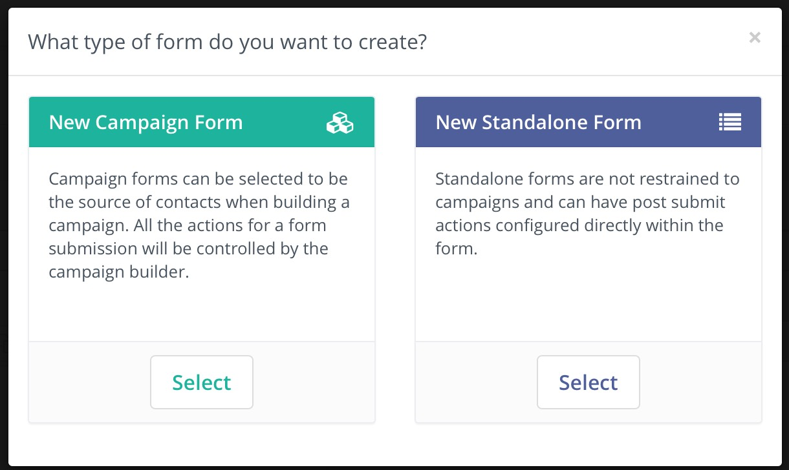
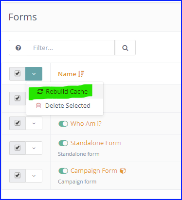

---
Forms are a special part of the marketing automation system. A form is used to collect user information often in exchange for providing access to a download, an event registration, or an email newsletter. Forms allow you to collect contact data and add additional information to their profile.

There are two kinds of forms in Mautic.

A **Campaign Form** can push a contact directly into a campaign but all actions are performed in the Campaign Builder.

A **Standalone Form** can push a contact into a segment, but not into a campaign directly.  The advantage to this form type is that you can perform actions at the time of submission. An example of this would be sending an email to an administrator with the form values included.

## Form Troubleshooting

### Form error messages does not show up or form redirect is not working

This is usually caused by URL mismatch. You can confirm this by going into the form preview page. Open the browser dev tools by pressing F12 on Windows or Linux or Option+Command+I on Mac. Go to the console tab and you should see 404 error on form JS.

To fix that, go to the Mautic Configuration and make sure the **Site URL** field is the correct Mautic URL root address (the one you see before the `/s/config/edit` part in the browser address bar) including the `http://` or `https://`. Save the configuration.

Now go to the Components / Forms and rebuild the forms HTML.

The 404 error should disappear after refres of the form preview page and the form validation messages should start working again.

## FAQ

### How to open an opt-in form in a modal window when the call-to-action button is clicked?

Often you need to show not an embedded form but a form that is showing up in a modal when a trigger button is clicked. 
Here is a short example how you can do that:

    <html>
    

    <body>
    {mauticform id=2 style=modal element=.call-to-action-btn} <!-- setup modal form -->

    <a class="btn btn-default call-to-action-btn" href="#">Click me</a> <!-- trigger button -->

    </body>
    </html>