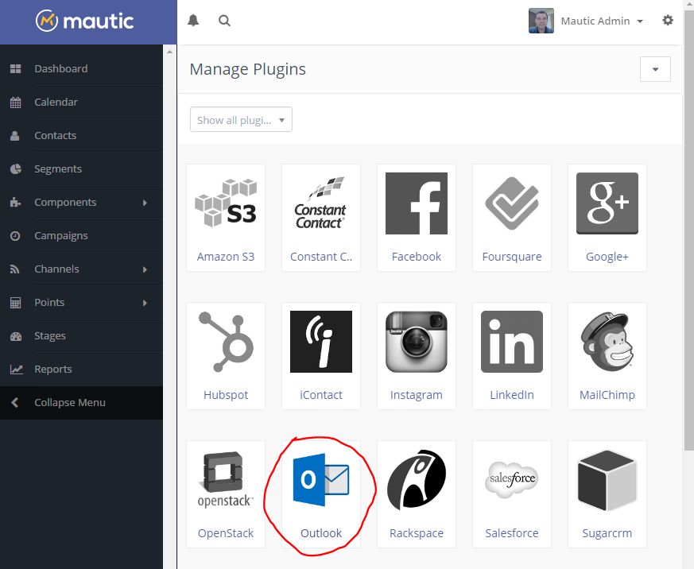
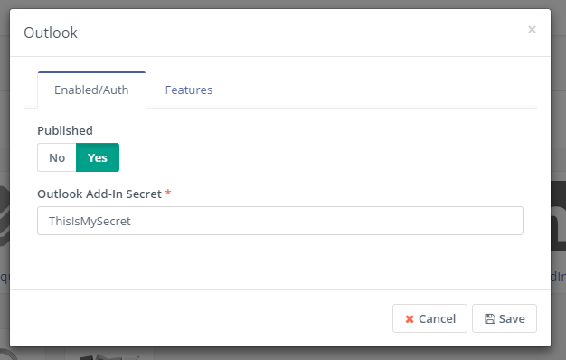
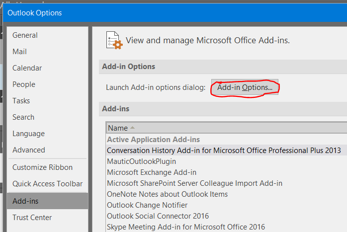
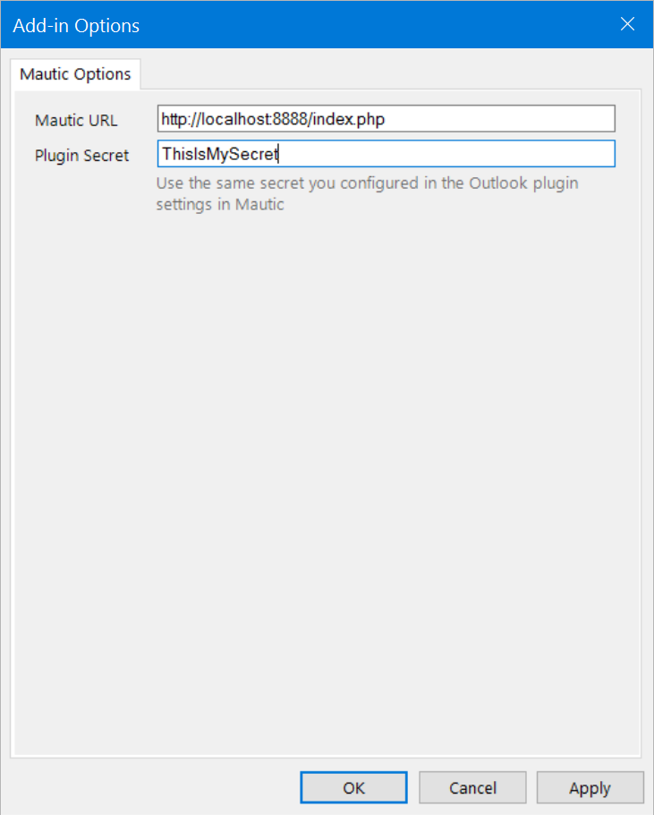
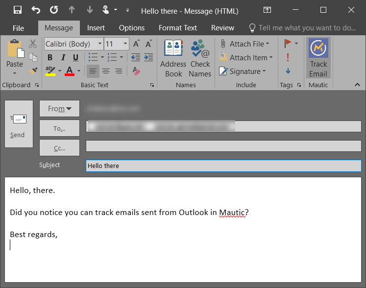
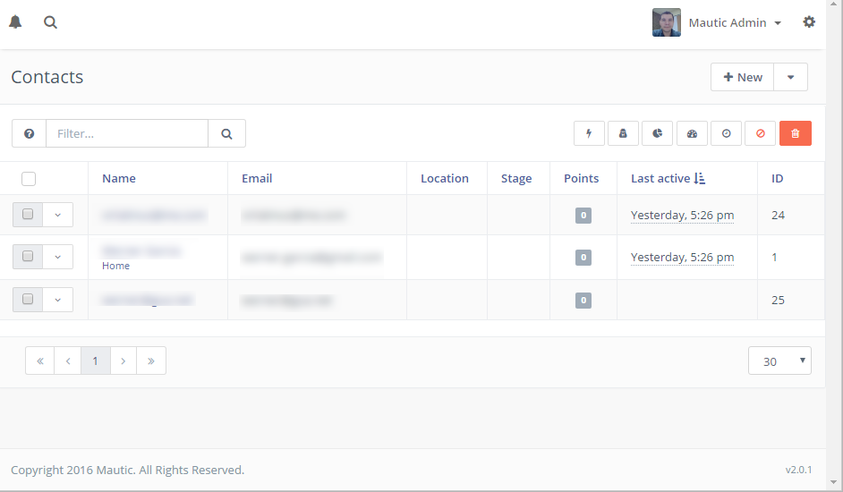
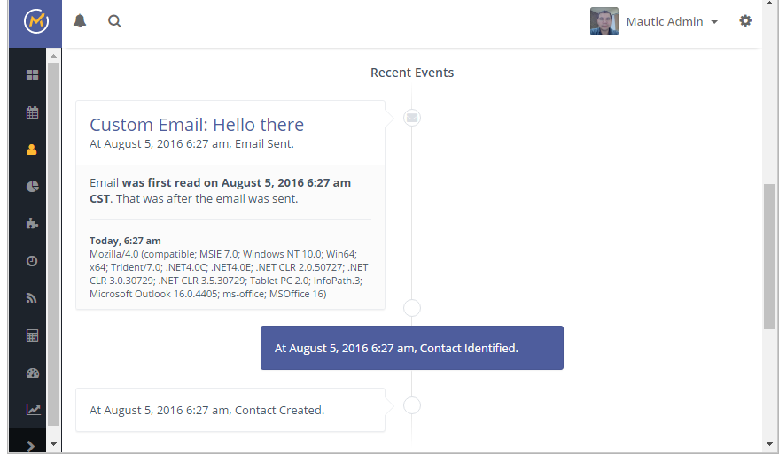

--------------------
## Mautic - Outlook plugin

This plugin allows for the Outlook Add-In to keep track of emails sent to leads.

### Requirements

- Mautic installed on a publicly accessible URL.
- Microsoft Outlook 2013 or 2016.
- [Mautic Outlook Add-In for Outlook 2013/2016](https://m.mautic.com/asset/24:microsoft-outlook-plugin-102)
- Emails should be sent in HTML format.

### Configure the plugin

Even if the plugin is compatible to Outlook 2013, this will describe the installation of the most recent compatible version, 2016.

1. Install the Mautic plugin as usual. It will appear on the plugins page in Mautic.


2. Click on the Outlook plugin button and enter a secret or key to validate the Outlook Add-In


3. Run the [Mautic Outlook Add-In Installer](https://m.mautic.com/asset/24:microsoft-outlook-plugin-102) on a Windows machine with Outlook 2016

4. On the Outlook 2016 Options window, select Add-Ins and click on the Add-In Options button


5. Type in the URL of the Mautic application, the same secret you used on the Mautic plugin page and click OK


6. To track an email sent to a lead, click the Track Email button on the New Email window


7. This will append a tracking GIF to the email with the following syntax:

   `https://example.com/index.php/outlook/tracking.gif?d=H4sIAAAAAAAEAIVRTW%2FCMAz9LRyCtgNVlFBpHHroWsRuk8ak7RpaUzqaGCUp0H8%2Fpy0TH4dJUZy892w921uLOvkCa8BGK2WLWi2dt6pUbM7PYPEcFainoFXdJKdBVvUy4quA9rxrNz9Q%2BCQ16HdgmeAenKewpfIU3lvfIO6nGyy75HNXO8LQAN3984R2X5tqMpkwnjOejrfg19%2FBJIHBJsskS3M1MOvOedChUA5HaPBAsp54a7UyBH%2BAw9YWECRrsMc6PHvFd2iR0NfW1QbcjUDwMjhctYqqq0YxkQU6SqMhNxi85GeoD8p0134zaBom%2By4ezlPMxTPFeCH5TLzI%2BdgizeEu5aIUQixmIubjSG5WAY8bC8kyC%2FvxSBX%2Flcvl3bT%2Fvr8k1oBgIQIAAA%3D%3D&sig=cf078d5b`

>**Important**
>
> Appending a tracking pixel via the Outlook plugin means that there is a possibility for false positives on email opens. This edge case occurs if the user's Outlook has the Preview Pane enabled for Sent Messages.

8. The Mautic plugin will then validate the information using the secret to compare signatures and then attach that email to the contact’s profile as part of their activity history. If the lead or leads don't exist, they are created automatically


  

## Sending emails in HTML format from Outlook

**This is mandatory to append the tracking pixel.**

There are 3 places to manage that:

1. In each new email window
2. In Settings > Mail > Compose messages
3. In Settings > Mail > Message format

## URL Parameter Length Issue

```ini
; Please note that PHP setups with the suhosin patch installed will have a
; default limit of 512 characters for get parameters. Although bad practice,
; most browsers (including IE) supports URLs up to around 2000 characters,
; while Apache has a default of 8000.

; To add support for long parameters with suhosin add the following to php.ini
suhosin.get.max_value_length = 5000
```

## How to Verify the tracking URL
You can check if the tracking URL that is added in Outlook is correct this way:
- send a test email with tracking on
- view the source of the sent email
- copy the tracking URL (probably at the bottom of the source file)
- open an incognito browser and past the url
- a blank (black) page should show. Not an error page like a 404 or file not found
- when the URL is correct, got to mautic/contacts and check it the contact was added or if an event was added to an existing contact
- you can also create a report for visited pages and filter for the tracking URL 
